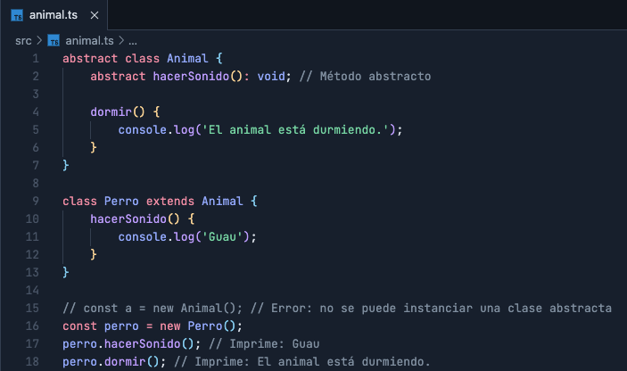
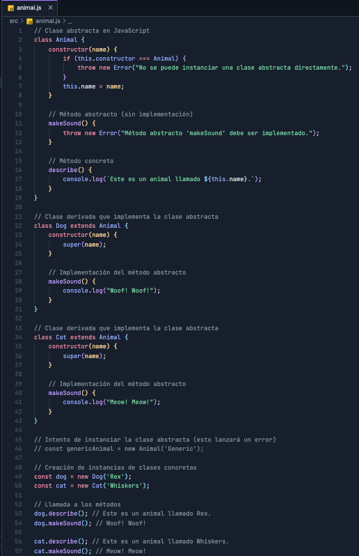
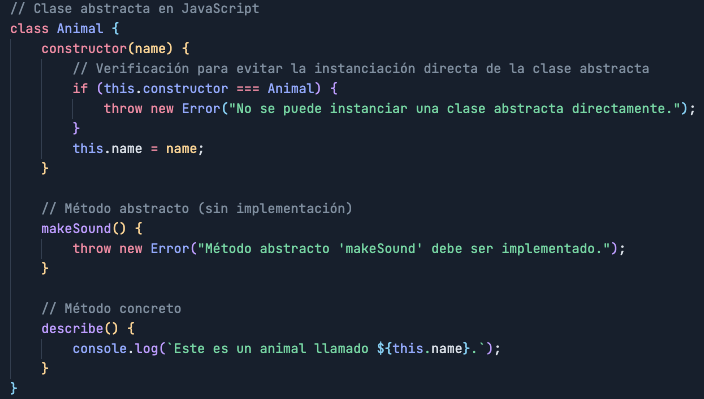

# Abstracción

la <code>Abstracción</code> es uno de los conceptos clave en la Programación Orientada a Objetos (POO) y juega un papel fundamental en la manera en que se modela y organiza el código. La abstracción permite simplificar el diseño de sistemas complejos al enfocarse en las características esenciales de un objeto mientras se ocultan los detalles no relevantes. Vamos a desglosar este concepto en detalle.

## Definición de Abstracción

La abstracción en POO es el proceso de definir clases y objetos en términos de sus comportamientos y propiedades esenciales sin considerar los detalles de implementación específicos. Permite a los diseñadores y desarrolladores concentrarse en el "qué" hace un objeto en lugar del "cómo" lo hace, simplificando el desarrollo y la comprensión del sistema.

## Componentes de la Abstracción

### Clases Abstractas

- 
<code>Definición:</code> Una clase abstracta es una clase que no puede ser instanciada directamente y se utiliza como base para otras clases. Define métodos y atributos que deben ser implementados por las clases derivadas.

- 
<code>Propósito:</code> Proporcionar una interfaz común y un conjunto de funcionalidades que las clases derivadas deben implementar.

- 
Ejemplo en JavaScript (con <code>abstract</code> en TypeScript):

#### Concepto de Clases Abstractas

Una clase abstracta es una clase que no puede ser instanciada directamente. En su lugar, está diseñada para ser heredada por otras clases que implementan sus métodos abstractos. Las clases abstractas proporcionan una forma de definir métodos que las clases derivadas deben implementar, pero no proporcionan una implementación concreta de esos métodos.

#### Características de las clases Abstractas

1. 
<b>No Instanciables:</b> No se puede crear una instancia directa de una clase abstracta. Solo se puede crear instancias de clases que la heredan y proporcionan implementaciones concretas.

2. 
<b>Métodos abstractos:</b> Una clase abstracta puede definir métodos abstractos, que son métodos sin implementación. Las clases que heredan de la clase abstracta deben proporcionar una implementación concreta para estos métodos.

3. 
<b>Métodos concretos:</b> Además de métodos abstractos, una clase abstracta puede tener métodos con implementación (métodos concretos). Las clases derivadas heredan estos métodos tal como están, aunque también pueden ser sobreescritos.

4. 
<b>Atributos y Propiedades:</b> Las clases abstractas pueden tener atributos y propiedades que las clases derivadas heredan.

5. 
<b>Constructores:</b> Las clases abstractas pueden tener constructores, que pueden ser utilizados por las clases derivadas para inicializar los atributos heredados.

#### Explicación del Ejemplo

1. Clase Abstracta <code>Animal</code>

En JavaScript, no existe una palabra clave <code>abstract</code> para definir clases abstractas como en algunos otros lenguajes orientados a objetos. Sin embargo, podemos simular el comportamiento de una clase abstracta usando técnicas como la verificación en el constructor y métodos sin implementación.

#### Detalles

1. 
Constructor de la Clase <code>Animal</code>:

-  
<code>constructor(name):</code> Inicializa el atributo <code>name</code> de la instancia.

-  
<code>Verificación:</code> La línea <code>if (this.constructor === Animal)</code> verifica si la clase que está creando la instancia es la propia clase <code>Animal</code>. Si es así, se lanza un error. Esto evita que la clase <code>Animal</code> sea instanciada directamente, lo que simula el comportamiento de una clase abstracta.

2. 
Método Abstracto <code>makeSound</code>:

-  
<code>makeSound():</code>Está diseñado para ser sobrescrito por clases derivadas. Lanzará un error si se llama directamente desde la clase <code>Animal</code>, indicando que las clases derivadas deben proporcionar una implementación específica.

3. 
Método Concreto <code>describe</code>:

-  
<code>describe():</code> Este método tiene una implementación concreta que puede ser utilizada por todas las instancias de las clases derivadas sin necesidad de sobrescribirla. Imprime el nombre del animal.

1. Clase Derivada <code>Dog</code>

>Sección en construcción
