# Clases

## ¿Que es una clase?

Una clase es una plantilla o un modelo que define la estructura y el comportamiento de los objetos. En otras palabras, una clase es una estructura que encapsula datos (atributos) y funciones (métodos) que operan sobre esos datos. Los objetos son instancias concretas de una clase.

> Nota
> 
> Encapsular datos
>
>- 
 Encapsulación es uno de los principios fundamentales de la programación orientada a objetos. Se refiere a la práctica de agrupar los datos (atributos) y las operaciones (métodos) que manipulan esos datos en una única unidad llamada <code>clase</code>.

>- 
 La encapsulación ayuda a proteger los datos de modificaciones indebidas, ya que las propiedades de la clase suelen ser accesibles solo a través de métodos específicos. Esto permite controlar cómo se accede y modifica el estado interno del objeto, promoviendo una interfaz más segura y mantenible.

>
> Instancia
>
>- 
 Una instancia es una ocurrencia concreta de una clase. Cuando creas un objeto basado en una clase, estás creando una instancia de esa clase.

>
>
En resumen, encapsular datos significa que una clase organiza y controla el acceso a sus atributos y métodos, mientras que instanciar una clase significa crear objetos concretos a partir de esa clase.

## Conceptos Clave
- **Atributos:** Variables que almacenan el estado del objeto.
- **Métodos:** Funciones que definen el comportamiento del objeto.
- **Instancias:** Objetos creados a partir de una clase.

### Sintaxis Básica:
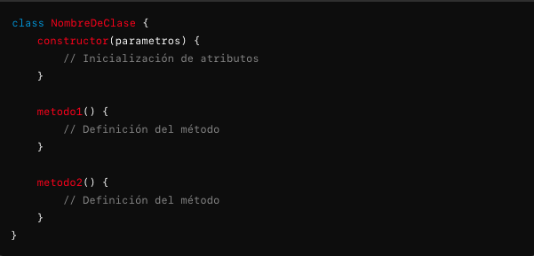

### Ejemplo Básico:
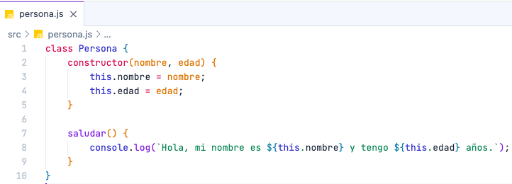

## Características de una clase

### Atributos
- 
<b>Descripción:</b> Los atributos son variables que pertenecen a una clase. Se definen dentro del constructor o directamente en la clase.

- 
<b>Visibilidad:</b> Por defecto, los atributos son públicos. JavaScript no tiene modificadores de acceso como <code>private</code> o <code>protected</code>, pero se pueden simular con métodos y convenciones.

### Métodos
- 
<b>Descripción:</b> Los métodos son funciones que pertenecen a una clase y definen su comportamiento. Los métodos se definen dentro del cuerpo de la clase.

- 
<b>Métodos Estáticos:</b> Los métodos estáticos se definen usando la palabra clave <code>static</code> y no requieren una instancia de la clase para ser llamados.

### Constructores
- 
<b>Descripción:</b> El constructor es un método especial que se llama automáticamente cuando se crea una instancia de la clase. Se utiliza para inicializar los atributos del objeto.

En la anterior clase <code>Persona</code>, podemos identificar:

#### Atributos
- 
<code>nombre:</code> Es una propiedad de la clase que almacena el nombre de la persona.

- 
<code>edad:</code> Es una propiedad de la clase que almacena la edad de la persona.

#### Constructor
- 
<code>constructor(nombre, edad):</code> Es un método especial que se utiliza para inicializar una nueva instancia de la clase. Toma dos parámetros (nombre y edad) y asigna estos valores a los atributos correspondientes de la instancia (<code>this.nombre</code> y <code>this.edad</code>).

#### Métodos
- 
<code>saludar():</code> Es un método de la clase que imprime un mensaje en la consola saludando a la persona y mostrando su nombre y edad.

### Métodos de Acceso (Getters y Setters)
- 
<b>Descripción:</b> Los getters y setters permiten controlar cómo se accede y se modifica el valor de los atributos privados. En JavaScript, se definen con las palabras clave <code>get</code> y <code>set</code>.

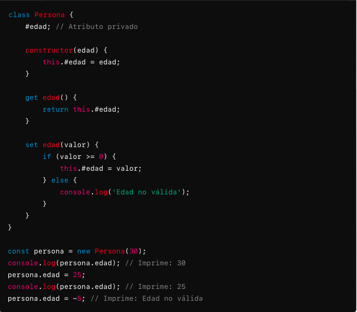

En la anterior clase <code>Persona</code>, podemos identificar:

#### Atributos
- 
<code>#edad:</code> Es un atributo privado de la clase, indicado por el prefijo <code>#</code>. Solo se puede acceder a él desde dentro de la clase.

#### Constructor
- 
constructor(edad):</code> Es un método especial que inicializa una nueva instancia de la clase. En este caso, toma un parámetro <code>edad</code> y asigna este valor al atributo privado <code>#edad</code>.

#### Métodos
- 
<code>get edad():</code> Es un <code>getter</code> para el atributo <code>#edad</code>. Permite acceder al valor del atributo privado desde fuera de la clase.

- 
<code>set edad(valor):</code> Es un <code>setter</code> para el atributo <code>#edad</code>. Permite modificar el valor del atributo privado, pero con una validación que asegura que el valor sea no negativo. Si el valor proporcionado es negativo, se muestra un mensaje de error en la consola.

### Ejemplos de Clases

#### Animal

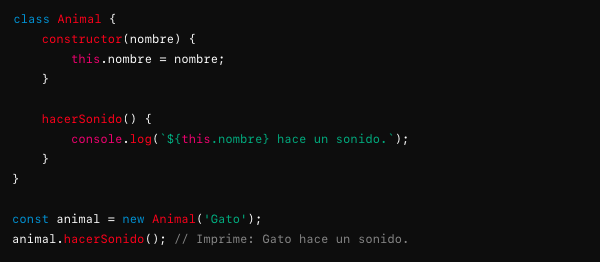

En la anterior clase <code>Animal</code>, podemos identificar:

#### Atributos
- 
<code>nombre:</code> Es un atributo público de la clase que almacena el nombre del animal. Se establece en el constructor y puede ser accedido y modificado directamente.

#### Constructor
- 
<code>constructor(nombre):</code></code> Es un método especial que inicializa una nueva instancia de la clase. Toma un parámetro <code>nombre</code> y asigna este valor al atributo <code>nombre</code> de la instancia.

#### Métodos
- 
<code>hacerSonido()</code> Es un método de la clase que imprime un mensaje en la consola, indicando que el animal hace un sonido. Utiliza el atributo <code>nombre</code> para personalizar el mensaje.

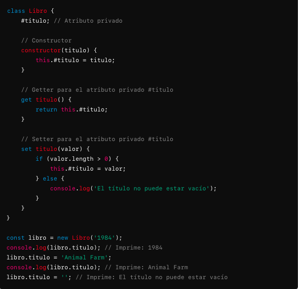

En la anterior clase <code>Libro</code>, podemos identificar:

#### Atributos
- 
<code>#titulo:</code> Es un atributo privado de la clase, indicado por el prefijo <code>#</code>. Solo se puede acceder a este atributo desde dentro de la clase <code>Libro</code>.

#### Constructor
- 
<code>constructor:(titulo)</code> Es un método especial que se utiliza para inicializar una nueva instancia de la clase. Toma un parámetro <code>titulo</code> y asigna este valor al atributo privado <code>#titulo</code>.

#### Métodos
- 
<code>get titulo():</code> Es un <code>getter</code> para el atributo privado <code>#titulo</code>. Permite acceder al valor del atributo <code>#titulo</code> desde fuera de la clase. Al invocar <code>libro.titulo</code>, se llama a este getter.

- 
<code>set titulo(valor):</code> Es un <code>setter</code> para el atributo privado <code>#titulo</code>. Permite modificar el valor del atributo <code>#titulo</code>, pero con una validación que asegura que el nuevo valor no sea una cadena vacía. Si el valor proporcionado es vacío, se muestra un mensaje de error en la consola. Al asignar un nuevo valor a <code>libro.titulo</code>, se llama a este setter.

#### Computador

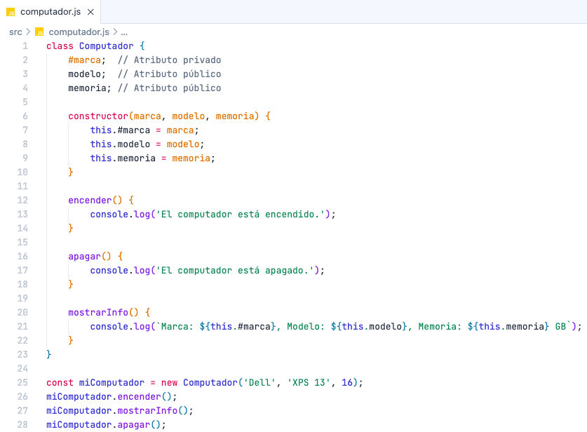

En la anterior clase <code>Computador</code>, podemos identificar:

#### Atributo Privado
- 
<code>#marca:</code> <i>(utiliza un <code>#</code> antes del nombre para indicar que es privado)</i>.

#### Atributos Públicos
- 
<code>modelo:</code> Almacena el modelo del computador..

- 
<code>memoria:</code> Almacena la cantidad de memoria del computador en GB.

#### Constructor
- 
<code>constructor(marca, modelo, memoria)</code> Inicializa los atributos <code>#marca</code>, <code>modelo</code>, y <code>memoria</code> con los valores proporcionados al crear una instancia de Computador.

#### Métodos
- 
<code>encender():</code> Imprime en la consola que el computador está encendido.

- 
<code>apagar():</code> Imprime en la consola que el computador está apagado.

- 
<code>mostrarInfo():</code> Imprime en la consola la información del computador, incluyendo la <code>marca</code> <i>(privada)</i>, el <code>modelo</code> y la <code>memoria</code>.

#### Getters y Setters
- No definidos en el código proporcionado.

Si necesitas definir getters y setters para el atributo privado <code>#marca</code>, podrías hacerlo así:

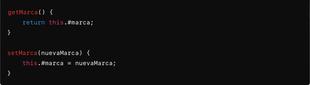

Y luego podrías usar estos métodos para acceder y modificar el atributo privado <code>#marca</code> de forma segura. Ademas puedes crear de esta misma manera los <code>getters</code> y </code>setters</code> faltantes para los atributos <code>modelo</code> y <code>memoria</code>.

> Recordatorio
> 
> Atributos Privados
>
>- 
 Los atributos privados están precedidos por un <code>#</code>, lo que significa que solo se pueden acceder dentro de la misma clase.

>
> Atributos Públicos
>
>- 
 Los atributos públicos son accesibles desde fuera de la clase.

#### Pais

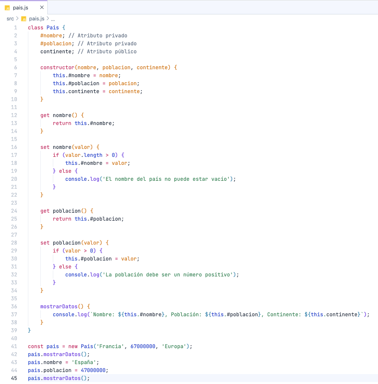

En la anterior clase <code>Pais</code>, podemos identificar:

#### Atributos Privados
- 
<code>#nombre:</code> Almacena el nombre del país.

- 
<code>#nombre:</code> Almacena la población del país.

#### Atributo Público
- 
<code>continente:</code> Almacena el continente al que pertenece el país.

#### Constructor
- 
<code>constructor(nombre, poblacion, continente):</code> inicializa los atributos privados <code>#nombre</code> y <code>#poblacion</code> con los valores proporcionados, y el atributo público <code>continente</code> con el valor proporcionado.

#### Métodos
- 
<code>mostrarDatos():</code> Es un método público que imprime en la consola una cadena de texto que incluye el nombre, la población y el continente del país.

#### Getters
-  
<code>get nombre():</code> Devuelve el valor del atributo privado <code>#nombre</code>.

-  
<code>get poblacion():</code> Devuelve el valor del atributo privado <code>#poblacion</code>.

#### Setters
-  
<code>set nombre(valor):</code> Permite modificar el valor del atributo privado <code>#nombre</code> si el nuevo valor no está vacío. Si el valor es vacío, muestra un mensaje de error.

-  
<code>set poblacion(valor):</code> Permite modificar el valor del atributo privado <code>#poblacion</code> si el nuevo valor es un número positivo. Si el valor no es positivo, muestra un mensaje de error.

> Recordatorio
>
> Los <code>getters</code> y <code>setters</code> se crean tanto para los atributos privados como para los públicos. Completar los <code>getters</code> y <code>setters</code> faltantes sería un excelente ejercicio.

#### Universidad

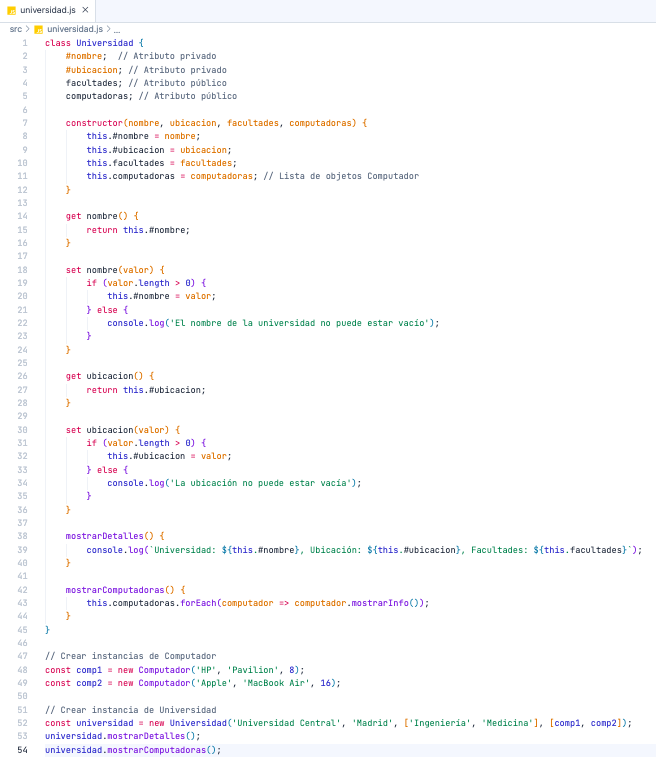

En la anterior clase <code>Universidad</code>, podemos identificar:

#### Atributos Privados
- 
<code>#nombre:</code> Almacena el nombre de la universidad.

- 
<code>#ubicacion:</code> Almacena la ubicación de la universidad.

#### Atributo Público
- 
<code>facultades:</code> Almacena una lista de facultades de la universidad.

- 
<code>computadoras:</code> Almacena una lista de objetos <code>Computador</code> que representan las computadoras disponibles en la universidad.

#### Constructor
- 
<code>constructor(nombre, ubicacion, facultades, computadoras):</code> el constructor toma cuatro parámetros (<code>nombre</code>, <code>ubicacion</code>, <code>facultades</code>, <code>computadoras</code>) y asigna estos valores a los atributos correspondientes. Los atributos privados <code>#nombre</code> y <code>#ubicacion</code> se inicializan con los valores proporcionados, y los atributos públicos <code>facultades</code> y <code>computadoras</code> también se inicializan.

#### Métodos
- 
<code>mostrarDetalles():</code> Este método imprime en la consola el <code>nombre</code> de la universidad, su <code>ubicación</code> y las <code>facultades</code> que tiene. Utiliza los atributos privados y públicos para mostrar la información.

- <code style="text-align: justify;"><code>mostrarComputadoras():</code> Este método itera sobre la lista de objetos <code>Computador</code> almacenados en computadoras y llama al método </code>mostrarInfo()</code> de cada objeto Computador. Se asume que la clase Computador tiene un método <code>mostrarInfo()</code> que imprime información sobre cada computadora.

#### Getters
-  
<code>get nombre():</code> Devuelve el valor del atributo privado <code>#nombre</code>.

-  
<code>get ubicacion():</code>  Devuelve el valor del atributo privado <code>#ubicacion</code>.

#### Setters
-  
<code>set nombre(valor):</code> Permite modificar el valor del atributo privado <code>#nombre</code> si el nuevo valor no está vacío. Si el valor es vacío, muestra un mensaje de error.

-  
<code>set ubicacion(valor):</code> Permite modificar el valor del atributo privado <code>#poblacion</code> si el nuevo valor es un número positivo. Si el valor no es positivo, muestra un mensaje de error.

### Notas Adicionales

Para que el código funcione correctamente, la clase <code>Computador</code> debe estar definida y debe incluir un método <code>mostrarInfo()</code> que imprima información sobre cada computadora. Aquí hay un ejemplo simple de cómo podría ser la clase Computador:
.

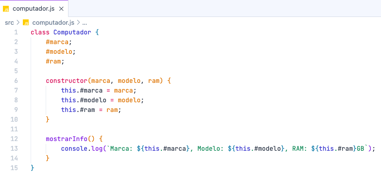

#### Coche

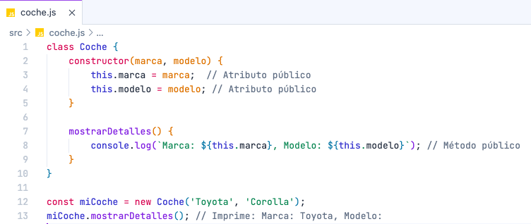

En la anterior clase <code>Coche</code>, podemos identificar:

#### Atributos
- 
<code>marca</code>  y <code>modelo</code>.

#### Constructor
- 
<code>constructor(marca, modelo)</code>.

#### Métodos
- 
<code>mostrarDetalles()</code>.

#### Persona

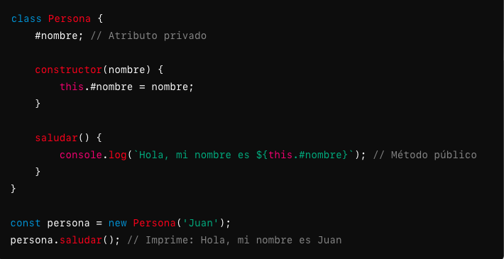

En la anterior clase <code>Persona</code>, podemos identificar:

#### Atributos
- 
<code>#nombre</code>. <i>(privado)</i>

#### Constructor
- 
<code>constructor(nombre)</code>.

#### Métodos
- 
<code>saludar()</code>.

## Ejercicios

### Ejercicio 1 - Clase Ciudad

- 
Crear una clase llamada <code>Ciudad</code>.
- Atributos privados <code>nombre</code> y <code>poblacion</code>.
- Atributos públicos <code>pais</code> y <code>superficie</code>. 
- Agregar un método llamado <code>mostrarDetalles</code> que imprima la información de la clase. 
- Implementar <code>getters</code> y <code>setters</code> de todos los atributos de las clases.
- Los <code>setters</code> en su implementación deben validar que el valor recibido por parametro:
  - Sea mayor a 0 si su atributo es un valor número <i>(se sobrentiende que los atributos <code>poblacion</code> y <code>superficie</code> son valores numéricos)</i>.
  - Sea una cadena de texto de mas de 3 caracteres si su atributo es una cadena de texto <i>(se sobrentiende que los atributos <code>pais</code> y <code>nombre</code> son cadenas de texto)</i>.
  - En caso que no cumplan esta condicion deben imprimir en consola el siguiente mensaje de error: <i>'El valor recibido por parametro genera un error'</i>.

### Ejercicio 2 - Clase tablet

- 
Crea una clase llamada <code>Tablet</code>.
- Atributos privados <code>serie</code> y <code>referencia</code>.
- Atributos públicos <code>marca</code> y <code>modelo</code>.
- Agregar un método llamado <code>mostrarDetalles</code> que imprima la información de la clase. 
- Implementar <code>getters</code> y <code>setters</code> de todos los atributos de las clases.
- Los <code>setters</code> en su implementación deben validar que el valor recibido por parametro <i>(se sobrentiende que todos los atributos son cadenas de texto)</i>:
  - Sea una cadena de texto de mas de 3 caracteres.
  - En caso que no cumplan esta condicion deben imprimir en consola el siguiente mensaje de error: <i>'El valor recibido por parametro debe tener al menos 3 caracteres'</i>.

### Ejercicio 3 - Clase Reloj

- 
Crea una clase llamada <code>Reloj</code>.
- Atributos privados: <code>marca</code>, <code>tipoCorrea</code>, <code>color</code> y <code>materialCaja</code>. 
- Agregar un método llamado <code>mostrarDetalles</code> que imprima la información de la clase.
- Agregar un método llamado <code>mostrarCategoriaCliente</code>, que use un <code>switch</code> en la implementación para imprimir:
  - 'Cliente de lujo' si la cadena de texto recibido por parametro es 'oro'.
  - 'Cliente VIP' si la cadena de texto recibida por parametro es 'ceramica'.
  - 'Cliente normal' si la cadena de texto recibida por parametro es 'acero inoxidable'.
  - El siguiente mensaje de error <i>'El tipo de caja no existe, solo existen "acero inoxidable", "oro" o "ceramica"'</i> si el valor recibido por parametro es otro.
- Implementar <code>getters</code> y <code>setters</code> de todos los atributos de las clases.
- - Los <code>setters</code> en su implementación deben validar que el valor recibido por parametro <i>(se sobrentiende que todos los atributos son cadenas de texto)</i>:
  - Sea una cadena de texto de mas de 3 caracteres.
  - En caso que no cumplan esta condicion deben imprimir en consola el siguiente mensaje de error: <i>'El valor recibido por parametro debe tener al menos 3 caracteres'</i>. 
  - El <code>setter</code> de <code>materialCaja</code> debe implementar un <code>switch</code> como se hizo para el método <code>mostrarCategoriaCliente</code>.

#### Ejercicios resueltos

- 
Una vez resuelva los ejercicios puede compararlos con mi propuesta de cada uno de ellos, los encontrará dentro del directorio <code>soluciones</code>
.