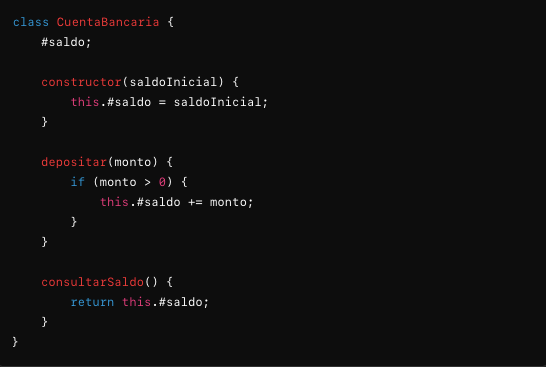

# Encapsulamiento

El <code>Encapsulamiento</code> es uno de los principios fundamentales en la Programación Orientada a Objetos (POO). Su objetivo principal es ocultar los detalles internos de la implementación de un objeto y exponer solo lo necesario para interactuar con él. Este concepto es clave para la modularidad, la seguridad y la mantenibilidad del software. Vamos a desglosar el concepto en detalle.

## Definición de encapsulamiento

El encapsulamiento se refiere a la práctica de agrupar los datos (atributos) y las operaciones (métodos) que manipulan esos datos en una sola unidad, conocida como objeto. Además, permite ocultar el estado interno del objeto a otras partes del programa y controlar el acceso a ese estado a través de una interfaz bien definida.

## Componentes del Encapsulamiento

### Atributos privados

Atributos que no son accesibles directamente desde fuera de la clase. Estos atributos suelen ser privados y están encapsulados dentro del objeto. Se accede a ellos a través de métodos públicos.

### Métodos públicos

Métodos que permiten a los usuarios interactuar con el objeto. Los métodos públicos son la única manera de manipular o acceder a los atributos privados del objeto.

### Getters y Setters

Métodos especiales que se utilizan para obtener (get) o modificar (set) el valor de atributos privados. Proporcionan un control adicional sobre el acceso a los atributos.

## Beneficios del encapsulamiento

### Protección de Datos

- 
<b>Descripción:</b> El encapsulamiento protege los datos internos del objeto de modificaciones no deseadas. Al ocultar los detalles de implementación, se minimizan los riesgos de que el estado del objeto sea alterado de manera incorrecta.

- 
<b>Ejemplo:</b> Usar un setter para validar la entrada antes de modificar un atributo.

### Modularidad

- 
<b>Descripción:</b> Facilita la división del sistema en módulos o componentes independientes. Cada objeto es responsable de su propio estado y comportamiento, lo que simplifica la comprensión y el mantenimiento del código.

- 
<b>Ejemplo:</b> Una clase <code>Coche</code>code> encapsula sus atributos como <code>marca</code>, <code>modelo</code> y sus métodos para operar sobre estos atributos.

### Mantenibilidad

- 
<b>Descripción:</b> Al cambiar la implementación interna de un objeto, no es necesario modificar el código que interactúa con él, siempre que la interfaz pública del objeto permanezca constante.

- 
<b>Ejemplo:</b> Modificar la forma en que se realiza un cálculo interno sin afectar la manera en que los usuarios del objeto invocan ese cálculo.

### Control de acceso

- 
<b>Descripción:</b> Permite controlar cómo y cuándo se accede o se modifica el estado del objeto. Los métodos públicos pueden incluir lógica para validar las operaciones antes de aplicar cambios.

- 
<b>Ejemplo:</b> Un método <code>retirar</code> en una clase <code>CuentaBancaria</code> puede asegurar que no se retire más dinero del que se tiene en la cuenta.

## Conclusión

El encapsulamiento es un principio esencial en la Programación Orientada a Objetos que ayuda a proteger los datos internos de los objetos, controlar el acceso a estos datos y promover la modularidad y mantenibilidad del código. A través de la encapsulación, los objetos exponen solo las interfaces necesarias para interactuar con ellos, ocultando los detalles internos y proporcionando un control más fino sobre cómo se manipulan sus estados y comportamientos.

