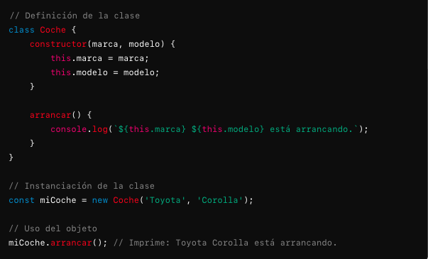
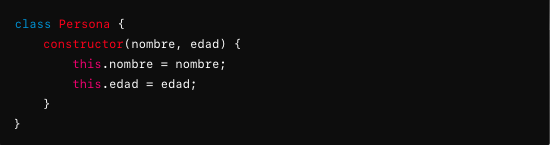
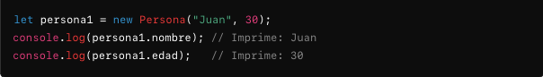
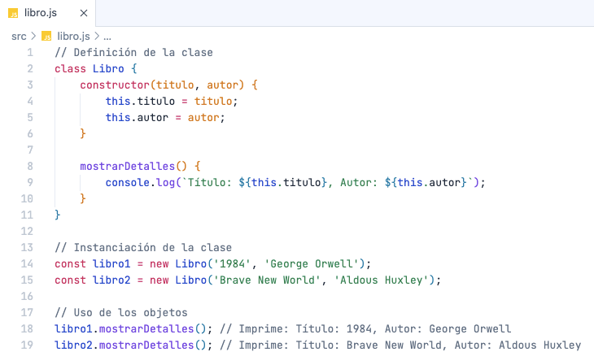
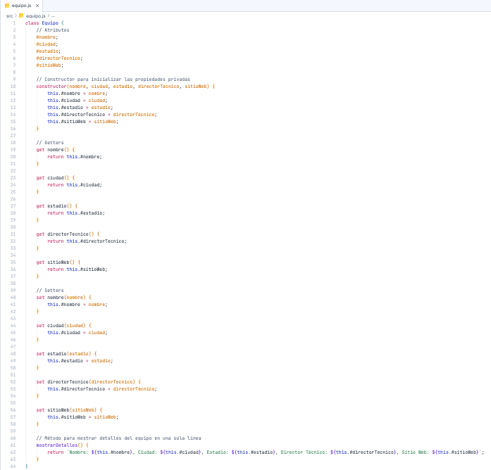
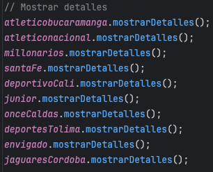

# Objetos

## ¿Qué es una objeto?
<p style="text-align: justify;">Un <code>objeto</code> es una instancia concreta de una <code>clase</code> en la Programación Orientada a Objetos. En términos sencillos, un <code>objeto</code> es una unidad de código que encapsula datos y métodos que operan sobre esos datos. Los <code>objetos</code> permiten modelar y manipular entidades del mundo real o conceptos abstractos dentro de un programa.</p>

## ¿Qué es instanciar un clase?
<p style="text-align: justify;">Instanciar una clase en la Programación Orientada a Objetos (POO) es el proceso de crear un <code>objeto</code> a partir de una <code>clase</code>. Esta acción convierte la definición abstracta de la <code>clase</code> en una instancia concreta que ocupa memoria y tiene un estado específico. Instanciar una <code>clase</code> implica la creación de un nuevo <code>objeto</code> que tiene atributos y comportamientos definidos por la <code>clase</code>.</p>

## Conceptos Clave
- <p style="text-align: justify;"><b>Clase:</b> Una clase es una plantilla o modelo que define las características y comportamientos comunes de un conjunto de objetos. Incluye atributos (datos) y métodos (funciones).</p>
- <p style="text-align: justify;"><b>Métodos:</b>Un objeto es una instancia concreta de una clase. Cada objeto creado a partir de una clase tiene su propio conjunto de valores para los atributos y puede utilizar los métodos definidos en la clase.</p>
- <p style="text-align: justify;"><b>Instanciación:</b> El proceso de crear un objeto a partir de una clase. Esto se realiza utilizando un constructor, que es un método especial de la clase que inicializa el nuevo objeto.</p>

## Proceso de Instanciación

1.  <p style="text-align: justify;"><b>Definir la Clase:</b> Primero, se define una clase con sus atributos y métodos.</p>
2.  <p style="text-align: justify;"><b>Llamar al Constructor:</b> La instanciación se realiza mediante una llamada al constructor de la clase. El constructor es un método especial que se invoca automáticamente cuando se crea un objeto.</p>
3.  <p style="text-align: justify;"><b>Crear el Objeto:</b> Al llamar al constructor, se crea una nueva instancia de la clase, que es el objeto. El objeto se inicializa con los valores proporcionados o predeterminados.</p>

## Ejemplo



## Detalles Técnicos

1. <p style="text-align: justify;"><b>Constructor:</b> Es el método que se llama automáticamente al crear un nuevo objeto. Puede aceptar parámetros para inicializar los atributos del objeto.</p>
2. <p style="text-align: justify;"><b>Palabra Clave <code>new</code></b> En muchos lenguajes orientados a objetos, como JavaScript, la palabra clave <code>new</code> se utiliza para crear una nueva instancia de una clase.</p>
3. <p style="text-align: justify;"><b>Inicialización:</b> Al instanciar una clase, los atributos del objeto se inicializan con los valores proporcionados al constructor, o con valores predeterminados si no se proporcionan valores.</p>
4. <p style="text-align: justify;"><b>Memoria:</b> Cada vez que se instancia una clase, se asigna memoria para el nuevo objeto. Esto incluye espacio para sus atributos y para almacenar la información sobre su comportamiento (métodos).</p>
5. <p style="text-align: justify;"><b>Encapsulación:</b> Cada objeto mantiene su propio estado y comportamiento, encapsulado dentro de su instancia. Los atributos y métodos del objeto están accesibles a través de la instancia, y el acceso a los datos puede estar controlado por métodos públicos, getters y setters.</p>

#### Como funciona



  <p style="text-align: justify;">Vamos a desglosar los parámetros:</p>
  
  - <p style="text-align: justify;"><b>nombre:</b> Este parámetro representa el nombre de la persona. Es un valor que se pasa al crear una nueva instancia de Persona y se asigna a la propiedad nombre del objeto.</p>
  - <p style="text-align: justify;"><b>edad:</b> Este parámetro representa la edad de la persona. Al igual que el parámetro nombre, se pasa al crear una instancia y se asigna a la propiedad edad del objeto.</p>

  <p style="text-align: justify;">Cuando creas una nueva instancia de la clase <code>Persona</code>, pasas valores para <code>nombre</code> y <code>edad</code>, y el constructor los usa para inicializar las propiedades <code>nombre</code> y <code>edad</code> del objeto. Por ejemplo:</p>

  

  - <p style="text-align: justify;"><code>nombre</code> es "Juan"</p>
  - <p style="text-align: justify;"><code>edad</code> es 30</p>

  <p style="text-align: justify;">Estos valores se asignan a las propiedades del objeto <code>persona1</code> gracias al constructor. En resumen, el constructor recibe los valores cuando se crea un objeto y los asigna a las propiedades correspondientes.

#### Beneficios de la Instanciación

<p style="text-align: justify;"><b>1. Modularidad:</b> Permite crear múltiples objetos de una misma clase, cada uno con su propio estado y comportamiento, promoviendo la modularidad y la reutilización del código.</p>
<p style="text-align: justify;"><b>2. Encapsulación:</b> Cada instancia encapsula sus propios datos y métodos, lo que ayuda a mantener el estado del objeto y a proteger los datos internos.</p>
<p style="text-align: justify;"><b>3. Organización:</b> Facilita la organización del código al modelar entidades del mundo real o conceptos abstractos en objetos separados.</p>

## Ejemplo

### Clase Libro



### Clase Libro creando nuevo objeto

- <p style="text-align: justify;">Teniendo en cuenta la siguiente tabla:</p>

| **Autor**                   | **Título**                                             | **Precio (USD)** | **Idioma** | **Lenguaje de Programación** |
|-----------------------------|--------------------------------------------------------|------------------|------------|------------------------------|
| Robert C. Martin            | Clean Code: A Handbook of Agile Software Craftsmanship | $35.00           | Inglés     | General                      |
| Andrew Hunt, David Thomas   | The Pragmatic Programmer: Your Journey to Mastery     | $40.00           | Inglés     | General                      |
| Charles Petzold             | Code: The Hidden Language of Computer Hardware and Software | $25.00           | Inglés     | General                      |
| Marijn Haverbeke            | Eloquent JavaScript: A Modern Introduction to Programming | $30.00           | Inglés     | JavaScript                   |
| Kyle Simpson                | You Don't Know JS (book series)                        | $45.00           | Inglés     | JavaScript                   |
| Al Sweigart                 | Automate the Boring Stuff with Python                  | $35.00           | Inglés     | Python                       |
| Eric Matthes                | Python Crash Course: A Hands-On, Project-Based Introduction to Programming | $35.00           | Inglés     | Python                       |
| Joshua Bloch                | Effective Java                                        | $40.00           | Inglés     | Java                         |
| Bjarne Stroustrup           | The C++ Programming Language                           | $55.00           | Inglés     | C++                          |
| Jon Skeet                   | C# in Depth                                            | $45.00           | Inglés     | C#                           |

<p style="text-align: justify;">Cree nuevos <code>objetos</code> de la clase <code>Libro</code>.</p>
 
> Recordatorio
> 
> Es importante priorizar la información, en este caso, solo nos importa abstraer la información de las columnas Autor y título para este ejercicio.

#### Solución

```
// Los objetos libro1 y libro2 ya existen
const libro3 = new Libro('Clean Code: A Handbook of Agile Software Craftsmanship', 'Robert C. Martin');
const libro4 = new Libro('The Pragmatic Programmer: Your Journey to Mastery', 'Andrew Hunt, David Thomas');
const libro5 = new Libro('Code: The Hidden Language of Computer Hardware and Software', 'Charles Petzold' );
const libro6 = new Libro('Eloquent JavaScript: A Modern Introduction to Programming', 'Marijn Haverbeke ');
const libro7 = new Libro('You Don\'t Know JS (book series)', 'Kyle Simpson');
const libro8 = new Libro('Automate the Boring Stuff with Python ', 'Al Sweigart');
const libro9 = new Libro('Python Crash Course: A Hands-On, Project-Based Introduction to Programming', 'Eric Matthes');
const libro10 = new Libro('Effective Java', 'Joshua Bloch');
const libro11 = new Libro('The C++ Programming Language', 'Bjarne Stroustrup');
const libro12 = new Libro('C# in Depth', 'Jon Skeet');
```
### Crear una nueva clase y nuevos objetos

- <p style="text-align: justify;"> De la siguiente tabla cree una clase llamada <code>Equipo</code> con sus respectivos atributos privados, <code>getters</code>, <code>setters</code>.</p>
- <p style="text-align: justify;"> Crear un método llamado <code>mostrarDetalles</code> el cual imprima en consola toda la información de la clase.</p>
- <p style="text-align: justify;"> Crear todos los objetos.</p>
- <p style="text-align: justify;"> Invocar el método <code>mostrarDetalles()</code> de cada objeto.</p>

| **Nombre**                  | **Ciudad**       | **Estadio**                    | **Director Técnico** | **Sitio Web**               |
|-----------------------------|------------------|--------------------------------|----------------------|-----------------------------|
| Atlético Bucaramanga        | Bucaramanga      | Estadio Alfonso López           | Diego Cagna          | [atleticobucaramanga.com](https://atleticobucaramanga.com) |
| Atlético Nacional           | Medellín         | Estadio Atanasio Girardot       | Paulo Autuori        | [nacionaldecali.com](https://www.atlnacional.com)        |
| Millonarios FC              | Bogotá           | Estadio El Campín               | Alberto Gamero        | [millonarios.com.co](https://www.millonarios.com.co)     |
| Independiente Santa Fe      | Bogotá           | Estadio El Campín               | Harold Rivera        | [santafe.com.co](https://www.santafe.com.co)             |
| Deportivo Cali              | Cali             | Estadio Deportivo Cali          | Rafael Dudamel       | [deportivocali.co](https://www.deportivocali.co)         |
| Junior FC                   | Barranquilla     | Estadio Metropolitano Roberto Meléndez | Samuel Piñeiro       | [juniorfc.co](https://juniorfc.co)                        |
| Once Caldas                 | Manizales        | Estadio Palogrande              | Pedro Sarmiento      | [oncecaldas.com](https://www.oncecaldas.com)             |
| Deportes Tolima             | Ibagué           | Estadio Manuel Murillo Toro     | Hernán Torres        | [deportestolima.com.co](https://www.deportestolima.com.co)|
| Envigado FC                 | Envigado         | Estadio Polideportivo Sur       | Eduardo Lara         | [envigadofc.com.co](https://www.envigadofc.com.co)       |
| Jaguares de Córdoba         | Montería         | Estadio Jaraguay                | Diego Martínez       | [jaguaresfc.co](https://jaguaresfc.co)                    |

#### Clase



#### Objetos

```
// Crear objetos de la clase Equipo con la información proporcionada
const atleticobucaramanga = new Equipo(
    "Atlético Bucaramanga",
    "Bucaramanga",
    "Estadio Alfonso López",
    "Diego Cagna",
    "https://atleticobucaramanga.com"
);

const atleticonacional = new Equipo(
    "Atlético Nacional",
    "Medellín",
    "Estadio Atanasio Girardot",
    "Paulo Autuori",
    "https://www.atlnacional.com"
);

const millonarios = new Equipo(
    "Millonarios FC",
    "Bogotá",
    "Estadio El Campín",
    "Alberto Gamero",
    "https://www.millonarios.com.co"
);

const santaFe = new Equipo(
    "Independiente Santa Fe",
    "Bogotá",
    "Estadio El Campín",
    "Harold Rivera",
    "https://www.santafe.com.co"
);

const deportivoCali = new Equipo(
    "Deportivo Cali",
    "Cali",
    "Estadio Deportivo Cali",
    "Rafael Dudamel",
    "https://www.deportivocali.co"
);

const junior = new Equipo(
    "Junior FC",
    "Barranquilla",
    "Estadio Metropolitano Roberto Meléndez",
    "Samuel Piñeiro",
    "https://juniorfc.co"
);

const onceCaldas = new Equipo(
    "Once Caldas",
    "Manizales",
    "Estadio Palogrande",
    "Pedro Sarmiento",
    "https://www.oncecaldas.com"
);

const deportesTolima = new Equipo(
    "Deportes Tolima",
    "Ibagué",
    "Estadio Manuel Murillo Toro",
    "Hernán Torres",
    "https://www.deportestolima.com.co"
);

const envigado = new Equipo(
    "Envigado FC",
    "Envigado",
    "Estadio Polideportivo Sur",
    "Eduardo Lara",
    "https://www.envigadofc.com.co"
);

const jaguaresCordoba = new Equipo(
    "Jaguares de Córdoba",
    "Montería",
    "Estadio Jaraguay",
    "Diego Martínez",
    "https://jaguaresfc.co"
);
```
#### Invocación



#### Resultado en consola

```
Nombre: Atlético Bucaramanga, Ciudad: Bucaramanga, Estadio: Estadio Alfonso López, Director Técnico: Diego Cagna, Sitio Web: https://atleticobucaramanga.com;
Nombre: Atlético Nacional, Ciudad: Medellín, Estadio: Estadio Atanasio Girardot, Director Técnico: Paulo Autuori, Sitio Web: https://www.atlnacional.com
Nombre: Millonarios FC, Ciudad: Bogotá, Estadio: Estadio El Campín, Director Técnico: Alberto Gamero, Sitio Web: https://www.millonarios.com.co
Nombre: Independiente Santa Fe, Ciudad: Bogotá, Estadio: Estadio El Campín, Director Técnico: Harold Rivera, Sitio Web: https://www.santafe.com.co
Nombre: Deportivo Cali, Ciudad: Cali, Estadio: Estadio Deportivo Cali, Director Técnico: Rafael Dudamel, Sitio Web: https://www.deportivocali.co
Nombre: Junior FC, Ciudad: Barranquilla, Estadio: Estadio Metropolitano Roberto Meléndez, Director Técnico: Samuel Piñeiro, Sitio Web: https://juniorfc.co
Nombre: Once Caldas, Ciudad: Manizales, Estadio: Estadio Palogrande, Director Técnico: Pedro Sarmiento, Sitio Web: https://www.oncecaldas.com
Nombre: Deportes Tolima, Ciudad: Ibagué, Estadio: Estadio Manuel Murillo Toro, Director Técnico: Hernán Torres, Sitio Web: https://www.deportestolima.com.co
Nombre: Envigado FC, Ciudad: Envigado, Estadio: Estadio Polideportivo Sur, Director Técnico: Eduardo Lara, Sitio Web: https://www.envigadofc.com.co
Nombre: Jaguares de Córdoba, Ciudad: Montería, Estadio: Estadio Jaraguay, Director Técnico: Diego Martínez, Sitio Web: https://jaguaresfc.co
```
## Ejercicios

### Ejercicio 1

- <p style="text-align: justify;"> De la siguiente tabla cree una clase llamada <code>Apple</code> con sus respectivos atributos privados, <code>getters</code>, <code>setters</code>.</p>
- <p style="text-align: justify;"> Crear un método llamado <code>mostrarDetalles</code> el cual imprima en consola toda la información de la clase.</p>
- <p style="text-align: justify;"> Crear todos los objetos.</p>
- <p style="text-align: justify;"> Invocar el método <code>mostrarDetalles()</code> de cada objeto.</p>

| **Dispositivo**        | **Modelo**             | **Precio** | **Cantidades Vendidas** | **País con Más Venta** | **Versión del Sistema Operativo** |
|------------------------|------------------------|------------|--------------------------|------------------------|----------------------------------|
| iPhone                 | iPhone 15 Pro          | $999       | 1,000,000                | Estados Unidos         | iOS 17                            |
| iPhone                 | iPhone 15              | $799       | 900,000                  | China                  | iOS 17                            |
| iPad                   | iPad Pro (11-inch)     | $799       | 700,000                  | Estados Unidos         | iPadOS 17                         |
| iPhone                 | iPhone 14              | $699       | 650,000                  | India                  | iOS 16                            |
| MacBook                | MacBook Air (M2)       | $1,199     | 600,000                  | Estados Unidos         | macOS Ventura                     |
| iPad                   | iPad (10th Gen)        | $449       | 550,000                  | China                  | iPadOS 16                         |
| iPhone                 | iPhone 14 Pro          | $999       | 500,000                  | Brasil                 | iOS 16                            |
| iPad                   | iPad Mini              | $499       | 450,000                  | Japón                  | iPadOS 16                         |
| MacBook                | MacBook Pro (M2)       | $1,299     | 400,000                  | Corea del Sur           | macOS Ventura                     |
| Apple Watch            | Apple Watch Ultra      | $799       | 350,000                  | Estados Unidos         | watchOS 10                        |

### Ejercicio 2

- <p style="text-align: justify;"> De la siguiente tabla cree una clase llamada <code>Samsung</code> con sus respectivos atributos públicos, <code>getters</code>, <code>setters</code>.</p>
- <p style="text-align: justify;"> Crear un método llamado <code>mostrarDetalles</code> el cual imprima en consola toda la información de la clase.</p>
- <p style="text-align: justify;"> Crear todos los objetos.</p>
- <p style="text-align: justify;"> Invocar el método <code>mostrarDetalles()</code> de cada objeto.</p>

| **Dispositivo**        | **Modelo**             | **Precio** | **Cantidades Vendidas** | **País con Más Venta** | **Versión del Sistema Operativo** |
|------------------------|------------------------|------------|--------------------------|------------------------|----------------------------------|
| Galaxy S23 Ultra       | Galaxy S23 Ultra       | $1,199     | 1,200,000                | Estados Unidos         | Android 13                       |
| Galaxy S23             | Galaxy S23             | $999       | 1,100,000                | Corea del Sur          | Android 13                       |
| Galaxy A54             | Galaxy A54             | $449       | 900,000                  | India                  | Android 13                       |
| Galaxy Z Fold 5        | Galaxy Z Fold 5        | $1,799     | 850,000                  | China                  | Android 13                       |
| Galaxy A34             | Galaxy A34             | $349       | 800,000                  | Brasil                 | Android 13                       |
| Galaxy S23+            | Galaxy S23+            | $1,099     | 750,000                  | Estados Unidos         | Android 13                       |
| Galaxy Z Flip 5        | Galaxy Z Flip 5        | $999       | 700,000                  | Corea del Sur          | Android 13                       |
| Galaxy A14             | Galaxy A14             | $299       | 650,000                  | India                  | Android 13                       |
| Galaxy Tab S9          | Galaxy Tab S9          | $799       | 600,000                  | Estados Unidos         | Android 13                       |
| Galaxy Note 20 Ultra   | Galaxy Note 20 Ultra   | $1,199     | 550,000                  | Japón                  | Android 12                       |

#### Ejercicios resueltos

- <p style="text-align: justify;">Una vez resuelva los ejercicios puede compararlos con mi propuesta de cada uno de ellos, los encontrará dentro del directorio <code>soluciones</code></p>.